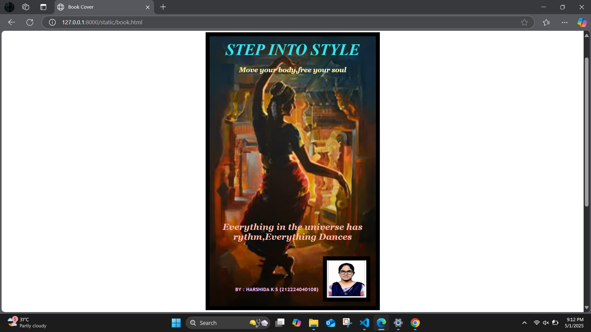

# Ex.06 Book Front Cover Page Design
## Date: 01-05-2025

## AIM:
To design a book front cover page using HTML and CSS.

## DESIGN STEPS:

### Step 1:
Create a Django Admin project.

### Step 2:
Create an app in the Django interface.

### Step 3:
Create a folder named 'static' in the app folder.

### Step 4:
Create a new HTML file in the static folder.

### Step 5:
Write the HTML code with relevant CSS properties.

### Step 6:
Choose the appropriate style and color scheme.

### Step 7:
Insert the images in their appropriate places.

### Step 8:
Publish the website in the LocalHost.

## PROGRAM:
```
<html>
    <head>
    <title>Book Cover</title>
    </head>
    <body bgcolor="white">
        <style>
            img{
                margin: 75px;
                border: 10px solid black;
            }
            .book{
                position: relative;
                text-align: center;
            }
            .book-text1{
                position: relative;
                bottom: 770px;
                font-family: Georgia, 'Times New Roman', Times, serif;
                font-weight: 1000px;
                font-style: italic;
                font-size: x-large;
                font-display:inherit;
                color:rgb(255, 238, 177);
            }
            .book-text{
                position: relative;
                text-align: center;
                bottom: 750px;
                color:rgb(53, 228, 234);
                font-family: 'Times New Roman', Times, serif;
                font-style: italic;
                font-size:larger;
                font-weight: 1000px;
            }
            .book-text2{
                position: relative;
                bottom: 450px;
                color:rgb(255, 187, 170);
                font-family: Georgia, 'Times New Roman', Times, serif;
                font-style: italic;
                font-weight: 1000px;
                font-size: large;
            }
            .book-text3{
                position: relative;
                bottom: 370px;
                color:rgb(255, 192, 247);
                font-family:'Trebuchet MS', 'Lucida Sans Unicode', 'Lucida Grande', 'Lucida Sans', Arial, sans-serif;
                font-weight: 1000px;
                right: 38px;
                font-size: large;
            }
            .mypic{
            position: relative;
            bottom: 560px;
            left:690px;
            width: 90px;
            height: 80px;
            background-size: contain;
        }
        </style>
        <center>
        <div class="book">
            
            <div class="book-text">
                <h1>STEP INTO STYLE</h1>
            </div>
            <div class="book-text1">
                <h6>Move your body,free your soul</h6>
            </div>
            <div class="book-text2">
                <h3>Everything in the universe has<br>rythm,Everything Dances</h3>
            </div>
            <div class="book-text3">
                <h6>BY : HARSHIDA K S (212224040108)</h6>
            </div>
            <div class="mypic">
                
            </div>
        </div>
    </body>
</html>
```

## OUTPUT:



## RESULT:
The program for designing book front cover page using HTML and CSS is completed successfully.
